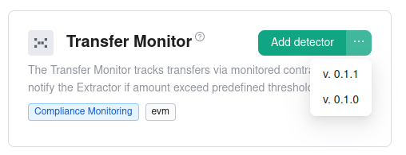
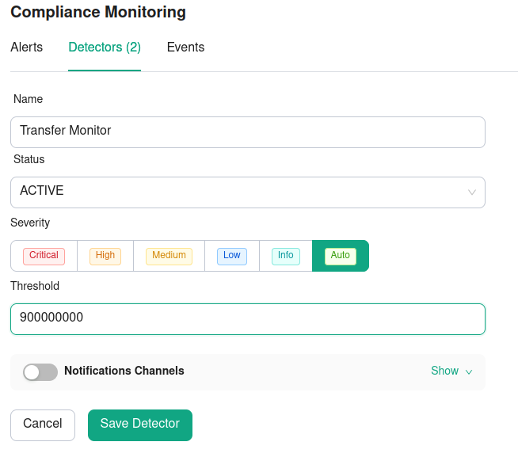

# How-Tos


## How to register the Transfer Monitor schema in the Extractor

Check if the Transfer Monitor already registered in the Extractor

```sh
sentinel manifest --action get --name "Transfer Monitor"

     ╷                  ╷         ╷        ╷
  id │ name             │ version │ status │ description
╶────┼──────────────────┼─────────┼────────┼────────────────────────────────╴
  49 │ Transfer Monitor │ 0.1.0   │ ACTIVE │ The Transfer Monitor tracks ...
     ╵                  
```
If you need to register new schema check the manifest file `monitor/manifest.py`, the version should be different with 
existing one. The Extrator does not allow to update a schema. 

Since we have version v0.1.0 deployed let's bump version to v0.1.1
```python
metadata = MetadataModel(
    name="Transfer Monitor",
    version="0.1.1",
```

Save the mainfest file and now you can register new manifest in the Extractor with the command

```sh
sentinel manifest --action register --classpath monitor.manifest
...
2024-07-05T12:31:40.487 [INFO] (sentinel.utils.logger) Importing service account tokens
...
2024-07-05T12:31:40.487 [INFO] (sentinel.utils.logger) The token EXT_API_TOKEN specified in env variables
2024-07-05T12:31:40.757 [INFO] (ManifestAPI) The schema registered succesfully
```

Check deployed manifests

```sh
sentinel manifest --action get --name "Transfer Monitor"

  id │ name             │ version │ status │ description
╶────┼──────────────────┼─────────┼────────┼──────────────────────────────────────────────╴
  49 │ Transfer Monitor │ 0.1.0   │ ACTIVE │ The Transfer Monitor tracks transfers via ... 
  51 │ Transfer Monitor │ 0.1.1   │ ACTIVE │ The Transfer Monitor tracks transfers via ...
```

## How to activate a monitor via Extractor

Login to the [Extractor](https://app.extractor.dev.hacken.cloud/), for selected contract, select menu option 
"Compliance Monitoring" and then click the button `Add detector`. Select "Transfer Monitor" 

. 

In our case, version 0.1.1

Change monitor parameters according to required configuration. For example, the threshold: 900000000



Then "Save Detector"

## How to run monitor from command line

Before monitor run, please check that the version of Transfer Monitor in the Extractor is the same with version 
in monitor database configuration (`monitor/profiles/databases.yaml`). In our case, it should be

```yaml
- id: transfer_monitor/monitored_address/ethereum
  type: sentinel.db.monitoring_conditions.remote.RemoteMonitoringConditionsDB
  parameters:
    bootstrap_servers: haas-dev-kafka1.hacken.dev:9092
    topics:
    - extractor.sync.detector
    network: ethereum
    model: monitor.manifest.Schema
    schema: { name: "Transfer Monitor", version: "0.1.1" }
```

To run the monitor from command line

```sh
sentinel launch --profile monitor/profile.yaml
```

The output should be
```

```


